# 📅 Evently

> A modern Flutter-based Event Management Application that allows users to create, manage, explore, and interact with events in real-time.

---

## 🚀 Overview

Evently is a full-featured event management mobile application built using **Flutter** and structured with a scalable, feature-based architecture.

The app enables users to create events, manage invitations, receive notifications, and interact with other users in a real-time environment powered by a RESTful backend API.

This project demonstrates production-level architecture, clean state management, and professional networking practices.

---

## ✨ Features

### 🔐 Authentication
- User registration & login
- JWT-based authentication
- Secure token storage
- Automatic token refresh
- Auto logout on refresh failure

### 📍 Event Management
- Create new events
- Edit existing events
- Delete events
- View full event details
- Pagination support
- Filtering & sorting

### 📩 Invitations
- Send event invites
- Resend declined invites
- Track invite status:
  - Accepted
  - Declined
  - Pending

### 🔔 Notifications
- General notifications
- Invite notifications
- Unread count tracking
- Mark all as read
- Paginated loading

### 🎨 UI/UX Enhancements
- Skeleton loading animations
- Pull-to-refresh support
- Responsive UI
- Draggable event details sheet
- Cached network images

---

### 🔹 State Management
- GetX Controllers
- Reactive state (Rx)
- Dependency injection using Bindings

### 🔹 Networking
- Dio HTTP client
- Centralized API service
- Interceptors for authentication
- Unified API status handling
- Error mapping layer

---

# 📸 Screenshots

  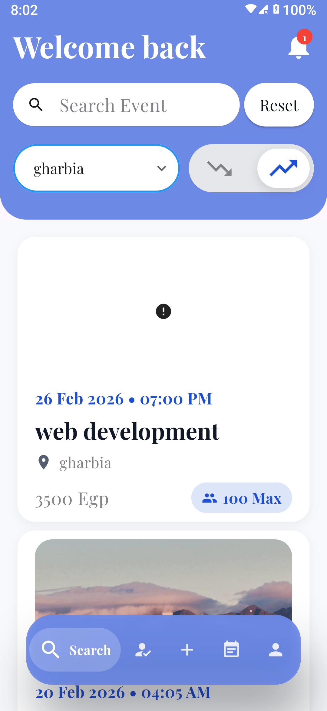
  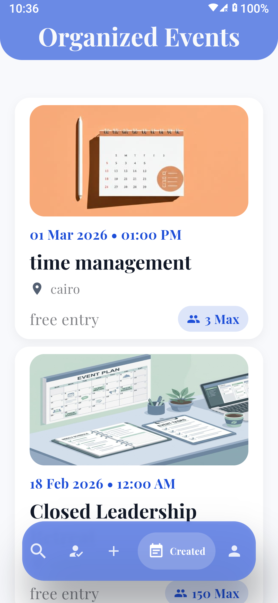
  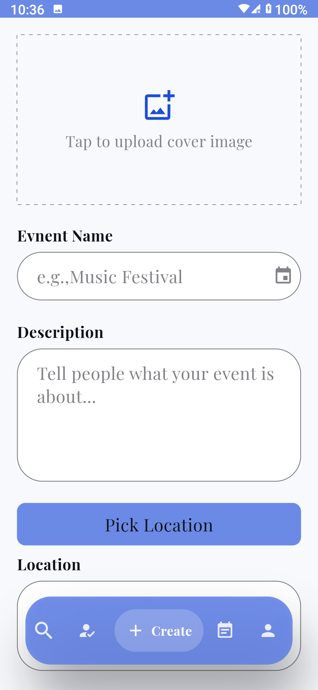
  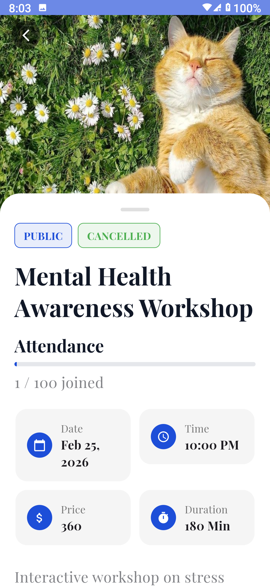
  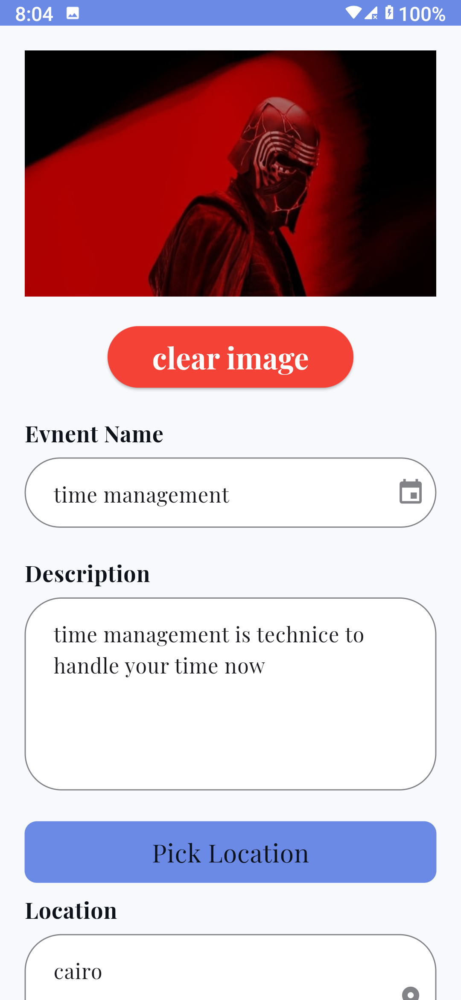

  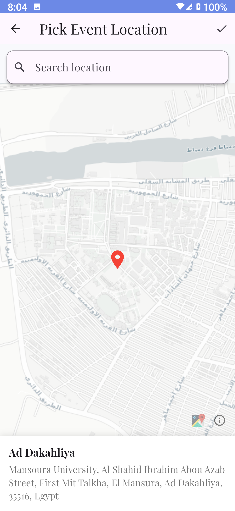
  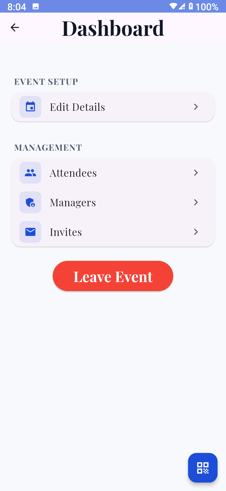
  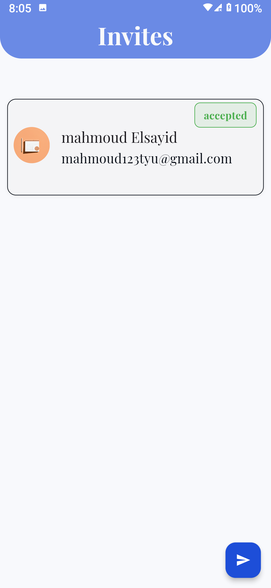
  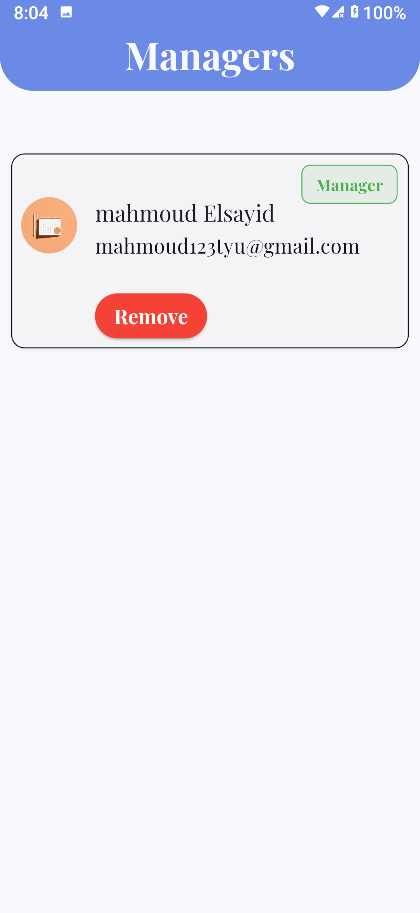
  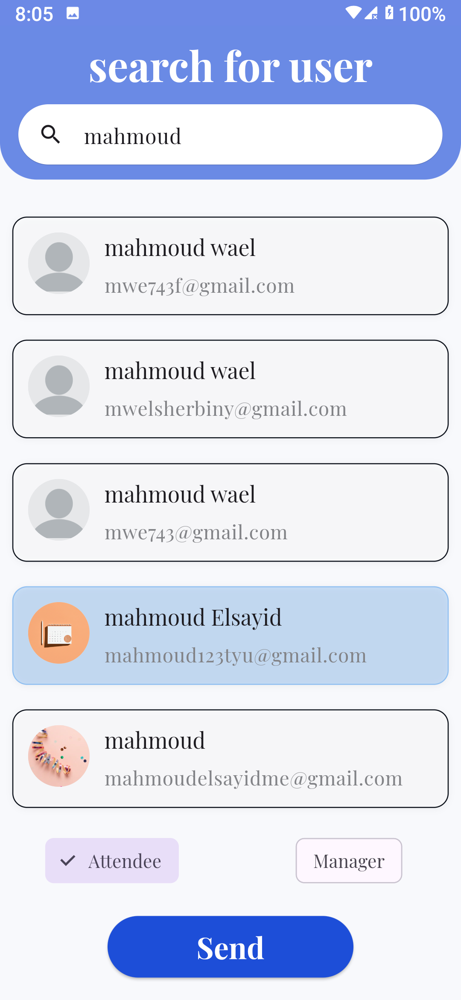

  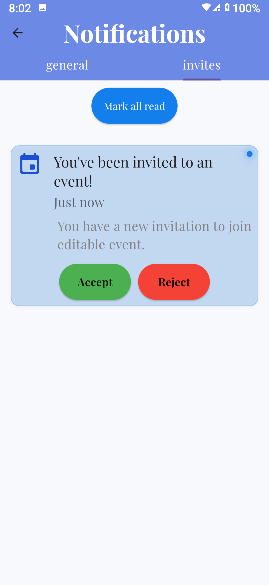
  
  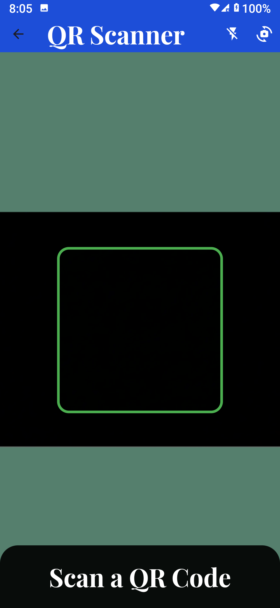
  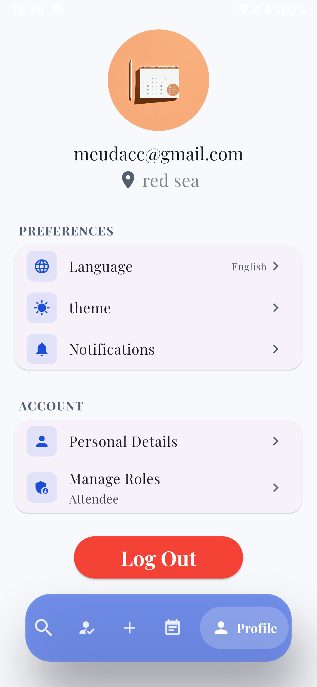
  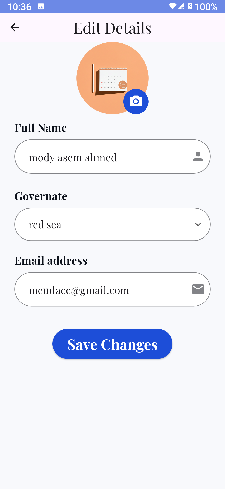

